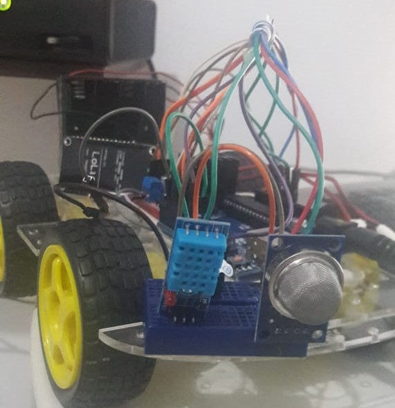
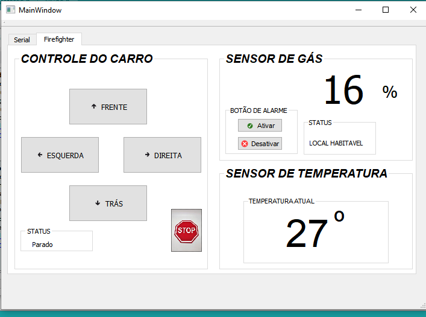
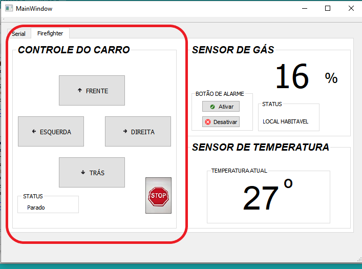
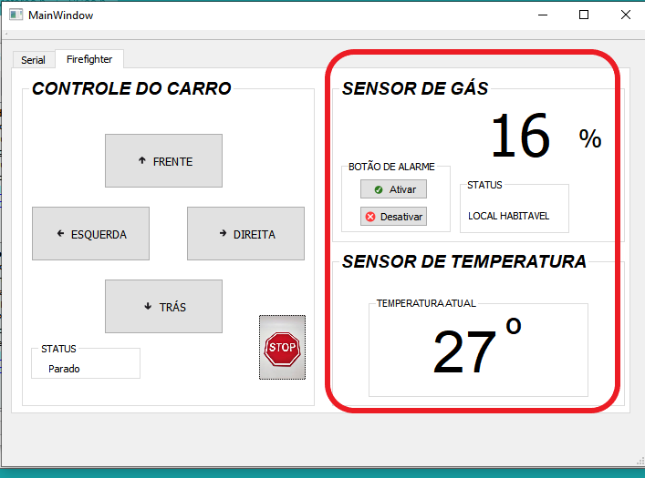

# Firefight
Aplicação do Firefight com a framework Qt, Arduino, Heroku e Nodemcu/ESP8266.
Projeto Elaborado para disciplina de Programação Estruturada.

# Sumário:
* O que é o Firefight? 
* Manual descritivo
* Como funciona o FireFight?
* Utilizando a aplicação.
* Monitorando Sensores
* Acionando Alarme
* Acionamento de Carrinho
* Informações de Utilização
* Materiais Utilizados
* Circuito e Montagens
* Página Web
* Software QT creator

# O que é o Firefight? 
  O Brasil está em terceiro lugar no ranking mundial de mortes por incêndio. A constatação se baseia no cruzamento de dados do Sistema Único de Saúde (SUS) com uma pesquisa realizada pela Geneva Association. Em 2011, o Sistema de Informações sobre Mortalidade do SUS registrou 1.051 mortes por incêndio ou por exposição a fumaça.  
  
  
   Dado esse cenário, sistemas de Detecção e Alarme de incêndio significam a primeira e mais importante informação sobre eventuais sinistros. Estudos mostram que 98% dos sinistros são efetivamente controlados quando combatidos em seu estágio inicial.
   O Firefight é um sistema de detecção de incêndio móvel controlado (robô controlado),  que utiliza  o sensor de Temperatura DHT11 e o sensor de gás inflamável e fumaça MQ-2. Esses  são capazes de  medir temperatura e umidade, e detectar concentrações de gases combustíveis e fumaça no ar, respectivamente.
   
# Manual Descritivo 
## Como funciona o projeto?
  A ideia do projeto é que o usuario possa ter controle da temperatura e nível de fumaça da sua residência ou imóvel de forma remota, e também offline. Para isso, será disponibilizado um site no qual haverá as informações da temperatura e gás, e esse controle poderá ser realizado através de um alarme, o qual é disparado quando os niveis de temperatura e fumaça se tornam nociveis, e o principio de icendio é detectado.Também há um software para que o usuário seja avisado diretamente via desktop, para a possibilidade de uso offline.
  
## Utilização do Software
### Tela de Conexão Serial
(IMAGEM DO QT SERIAL)
A tela de início da aplicação do projeto é bastante direta. Primeiro, o usuário deve conectar o seu cabo USB do Arduino em seu computador. Logo em seguida, deve ser selecionada a **porta** na qual a placa está conectada. Para que as informações sejam transmitidas, faz-se necessário ter uma **velocidade** específica (em bauds) para comunicação, sendo  que seja necessário selecionar 115200 (**velocidade  padrão da placa**). Por fim, se a conexão for bem sucedida, um  texto será exibido instantaneamente, avisando ao usuário se o mesmo conseguiu se conectar, caso contrário o usuário deve repetir todo o processo acima citado.

Na segunda Aba **FireFight** é onde estão localizados os botões que acionam os motores do Carrinho, e telas nas quais pode ser feito o monitoramento de temperatura e nivel de gás, presente no ambiente.

### Tela Principal (Acionamento dos Motores do Carrinho)

 Na parte de acionamento dos motores, há 4 botões sinalizados com sua direção e 1 botão de PARE, esses quando acionados movimentam o robô de forma automatica. Dessa forma, o usuário pode  monitorar ambientes de dificil acesso.

### Tela Principal (Monitoramento dos Sensores de Temperatura e Gás)
 Na parte de Monitoramento, há duas telinhas, uma com o valor de Gás presente no ambiente (%)  medido pelo sensor MQ-2 , e outra telinha que exibi o valor do sensor de temperatura medida pelo sensor DHT11, retornando para o usuário a temperatura do ambiente naquele momento. 
  **OBS: Quando os niveis de temperatura e gás  do ambiente é considerada nociva é acionado um alarme (BUZZER SONORO) no carrinho, alertando ao usuário o principio de incêndio no local.  Esse alarme pode também ser Acionado e Desativado de forma manual pelo usuário, na opção (BOTÃO DE ALARME)**
  
 

## Primeiros Passos:
A tela de início da aplicação do projeto é bastante direta. Primeiro, o usuário deve conectar o seu cabo USB do Arduino em seu computador. Logo em seguida, deve ser selecionada a **porta** na qual a placa está conectada. Para que as informações sejam transmitidas, faz-se necessário ter uma **velocidade** específica (em bauds) para comunicação, sendo  que seja necessário selecionar 115200 (**velocidade  padrão da placa**). Por fim, se a conexão for bem sucedida, um  texto será exibido instantaneamente, avisando ao usuário se o mesmo conseguiu se conectar, caso contrário o usuário deve repetir todo o processo acima citado.

Voce precisa cadastrar todos os dados sobre seu livro como: nome, nome do autor, numero de páginas...
Quando terminar de preencher todas informações não se esqueça de clickar no botão **Cadastrar na Estante** , ok?

*OBS:, Só  são válidas notas de 1 á 10, e nomes com quantidade de letra superior a 2.*

## Tem como ordenar por nota ou nome de livro:
Seu desejo é uma ordem! Há dois botões na tela principal que possibilitam isso.

## Telinha de Relátorios?

Essa é a parte mais legal do aplicativo! Voce pode administrar e controlar todos os livros da sua estante por:
* Quantidade de Livros 
* Quantidade de Livros Lidos
* Quantidade de Livros Lendo
* Quantidade de Livros Emprestados

*Isso mesmo! Voce também pode salvar seus livros emprestados, na opção na tela inicial **Emprestados**  *

## Extra super fantástico?

Temos! No aplicativo há uma aba que voce pode acessar sua biblioteca virtual online, e tambem um site super legal de Livros!
* Skoob
* Lelivros
* **Nosso incrivel manual!** 

## AHH eu quase que me esquecia!

Temos uma aba pata voce salvar seus livros em um arquivo txt!

# Espero que voce goste!
# BookShelf
# Boa Leitura

