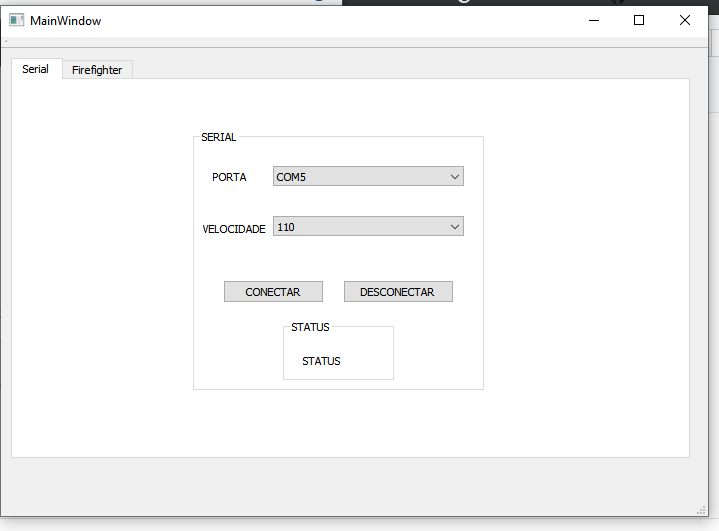
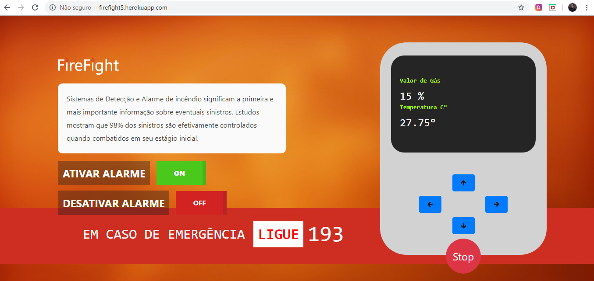
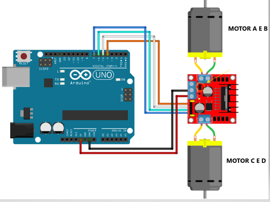
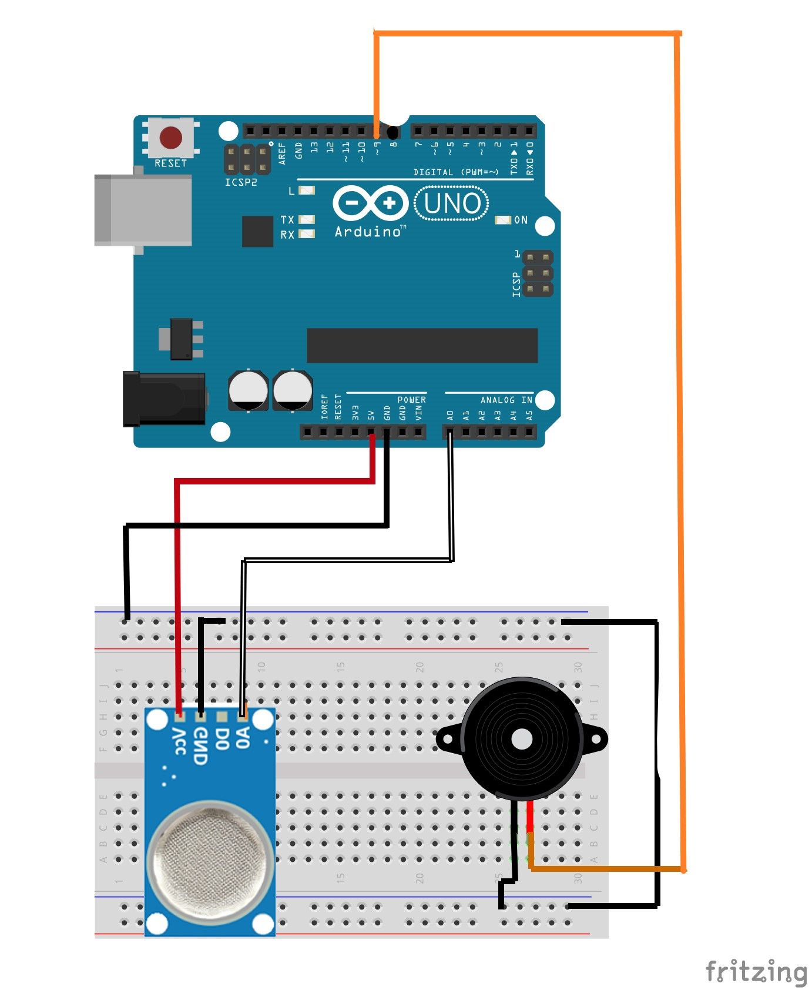
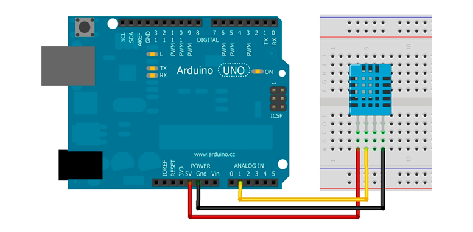
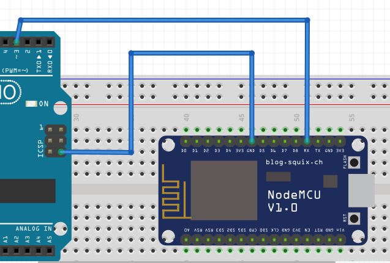

# Firefight
Aplicação do Firefight com a framework Qt, Arduino, Heroku e Nodemcu/ESP8266.
Projeto Elaborado para disciplina de Programação Estruturada.

# Sumário:
* O que é o Firefight? 
* Manual descritivo
* Como funciona o FireFight?
* Utilizando a aplicação (QT creator).
* Monitorando Sensores
* Acionando Alarme
* Acionamento de Carrinho
* Utilizando o Site
* Materiais Utilizados
* Circuito e Montagens
* NodeMCU e MQTT
* Página Web
* Desktop e Hardware

# O que é o Firefight? 
  O Brasil está em terceiro lugar no ranking mundial de mortes por incêndio. A constatação se baseia no cruzamento de dados do Sistema Único de Saúde (SUS) com uma pesquisa realizada pela Geneva Association. Em 2011, o Sistema de Informações sobre Mortalidade do SUS registrou 1.051 mortes por incêndio ou por exposição a fumaça.  
  
  
   Dado esse cenário, sistemas de Detecção e Alarme de incêndio significam a primeira e mais importante informação sobre eventuais sinistros. Estudos mostram que 98% dos sinistros são efetivamente controlados quando combatidos em seu estágio inicial.
   O Firefight é um sistema de detecção de incêndio móvel controlado (robô controlado),  que utiliza  o sensor de Temperatura DHT11 e o sensor de gás inflamável e fumaça MQ-2. Esses  são capazes de  medir temperatura e umidade, e detectar concentrações de gases combustíveis e fumaça no ar, respectivamente.
   
# Manual Descritivo 
## Como funciona o projeto?
  A ideia do projeto é que o usuario possa ter controle da temperatura e nível de fumaça da sua residência ou imóvel de forma remota, e também offline. Para isso, será disponibilizado um site no qual haverá as informações da temperatura e gás, e esse controle poderá ser realizado através de um alarme, o qual é disparado quando os niveis de temperatura e fumaça se tornam nociveis, e o principio de icendio é detectado.Também há um software para que o usuário seja avisado diretamente via desktop, para a possibilidade de uso offline.
  
## Utilização do Software (QT CREATOR)
### Tela de Conexão Serial

A tela de início da aplicação do projeto é bastante direta. Primeiro, o usuário deve conectar o seu cabo USB do Arduino em seu computador. Logo em seguida, deve ser selecionada a **porta** na qual a placa está conectada. Para que as informações sejam transmitidas, faz-se necessário ter uma **velocidade** específica (em bauds) para comunicação, sendo  que seja necessário selecionar 115200 (**velocidade  padrão da placa**). Por fim, se a conexão for bem sucedida, um  texto será exibido instantaneamente, avisando ao usuário se o mesmo conseguiu se conectar, caso contrário o usuário deve repetir todo o processo acima citado.

Na segunda Aba **FireFight** é onde estão localizados os botões que acionam os motores do Carrinho, e telas nas quais pode ser feito o monitoramento de temperatura e nivel de gás, presente no ambiente.

### Tela Principal (Acionamento dos Motores do Carrinho)

 Na parte de acionamento dos motores, há 4 botões sinalizados com sua direção e 1 botão de PARE, esses quando acionados movimentam o robô de forma automatica. Dessa forma, o usuário pode  monitorar ambientes de dificil acesso.

### Tela Principal (Monitoramento dos Sensores de Temperatura e Gás)
 Na parte de Monitoramento, há duas telinhas, uma com o valor de Gás presente no ambiente (%)  medido pelo sensor MQ-2, e outra que exibi o valor do sensor de temperatura medida pelo sensor DHT11, retornando para o usuário a temperatura do ambiente naquele momento. 
  
  
  
  **OBS: Quando os niveis de temperatura e gás  do ambiente é considerada nociva é acionado um alarme (BUZZER SONORO) no carrinho, alertando ao usuário o principio de incêndio no local.  Esse alarme pode também ser Acionado e Desativado de forma manual pelo usuário, na opção (BOTÃO DE ALARME)**
 
## Utilização do Site 
  
  
  O site da aplicação pode ser acesso através do   link: http://firefight5.herokuapp.com/ , ele  permite que o usuário tenha acesso remoto à aplicação, apenas sendo necessário conexão com a internet. Todas as funcionalidades, são semelhantes as citadas acima.
  
## Materiais utilizados:
* Arduino UNO
* Kit Chassi - 4 Motores
* Pack de 8 Pilhas (**Ou de Baterias**)
* Ponte H Lm298
* NodeMCU ESP8266-12
* Sensor de Temperatura e Umidade DHT11
* Sensor de Gas MQ-2 
* Buzzer Sonoro (3V)
* Jumpers para conexão do circuito

## Circuitos:

### Circuito de Montagem  Motores e Ponte H:

### Circuito de Montagem Sensor MQ-2 e Buzzer Sonoro:

### Circuito de Montagem Sensor DHT 11:

### Montagem Arduino Com NodeMcu:

**OBS: O NodeMcu foi utulizado em substituição da Esp01, apenas para fazer a conexão Wifi todos os códigos de conexão com a rede , encontram -se disponiveis nesse repositorio, é aconselhado que utilize um conversão Digital de Sinal para fazer essa ligação, pórem não é necessário.**

## NodeMCU e MQTT
O MQTT (Message Queue Telemetry Transport) consiste em um protocolo de mensagens leve, criado para comunicação M2M (Machine to Machine). Por exigir muito pouco  de processamento e banda / consumo de Internet, este é um dos protocolos ideais para dispositivos embarcados. E por essa razão foi utilizado nessa aplicação. 

Uma comunicação MQTT é composta das seguintes partes: há **publishers** (quem irá disponibilizar informações), **subscribers** (quem irá receber as informações) e Broker (servidor MQTT, na nuvem / acessível de qualquer lugar do planeta que contenha conexão com a Internet). Teoricamente, não há limite especificado de subscribers e publishers em uma mesma comunicação MQTT, pois o limite nesse aspecto  é do servidor em lidar com as conexões.

Em resumo:  publishers enviam informação para o Broker, subscribers recebem informação do Broker e o Broker gerencia a troca de mensagens com o servidor. Ou seja, o trabalho pesado fica a cargo do Broker, deixando os sistemas embarcados livre.
*Um esquema básico dessa comunicação pode ser acessado via:* https://1sheeld.com/mqtt-protocol/

**Nesse projeto foi utilizado o protocolo MQTT, mas poderia ser feito de forma mais simples, pois não havia necessidade de tanto processamento, pois os números de sensores e atuadores eram pequenos**
Todos os códigos referentes a essa comunicação, encontra-sem disponiveis neste repositório. 

*MAIS INFORMAÇÕES SOBRE MQTT PODEM SER ACESSADAS ATRAVÉS  DO SITE OFICIAL:* http://mqtt.org/
**COMO BASE PARA DESENVOLVIMENTO DESSE TRABALHO FOI UTILIZADO  O PROJETO A SEGUIR:** https://github.com/sankarcheppali/NodeMCUProjects/tree/master/ArduinoWithNodeMCU

## Servidor Web
Esta página web está hospedada gratuitamente no  domonio Heroku e pode ser acessada através do link : http://firefight5.herokuapp.com.
O Heroku é uma plataforma do tipo cloud que permite o deploy de aplicações para desenvolvedores. Nesse projeto utilizamos HTML e CSS, para poder organizar e interagir  o site com a  ESP8266. Foi utilizada também a biblioteca Flask feita pela comunidade do Python,que foi bastante importante para essa aplicação.

## Desenvolvimento Desktop e Hardware

O software Desktop foi desenvolvido, para o controle do usuario sobre a aplicação, sem acesso a internet.  Aqui, foi utilizado a framework QT creator, a linguagem utilizada foi o C++ . Já no que diz respeito ao Hardware foi utilizado para programação do Arduino e do NodeMCU o Arduino IDE, também programado em liguagem C.

